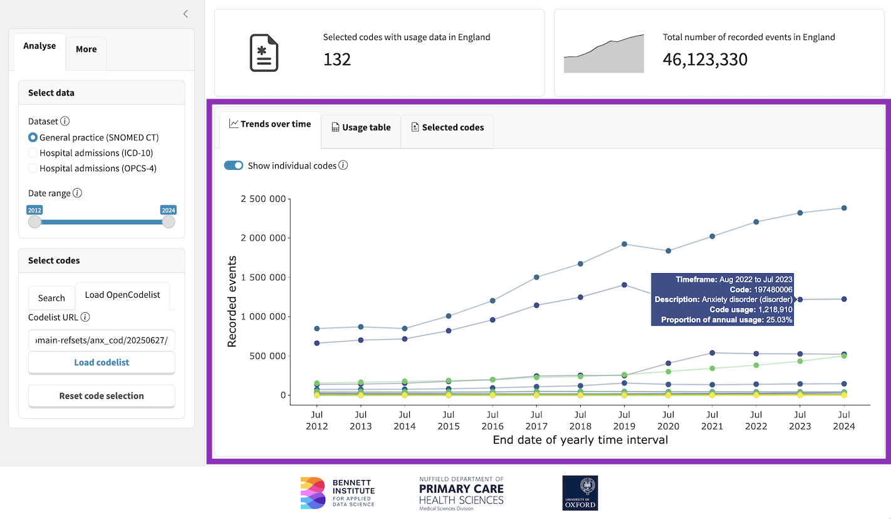
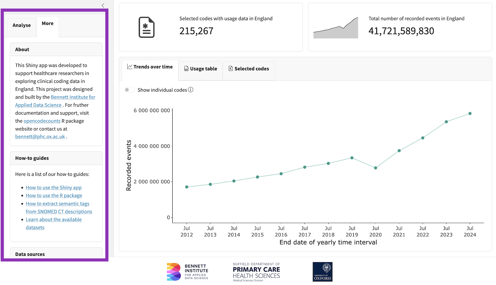

```{r, include = FALSE}

knitr::opts_chunk$set(
  collapse = TRUE,
  comment = "#>",
  fig.align="center",
  out.width="100%"
)
```

## Overview

The `opencodecounts` Shiny app is an interactive tool for exploring clinical code usage data in England. It visualises trends over time and helps you search, filter, and analyse clinical codes from three major coding systems used in the NHS.
It can be launched locally with the `run_app()` function or accessed online at [https://bennettoxford.github.io/opencodecounts/articles/app](https://bennettoxford.github.io/opencodecounts/articles/app).

## Step 1: Select data

The Shiny app has a sidebar to select one of the available datasets (i.e., SNOMED CT, ICD-10, or OPCS-4) and search for a specific code or a collection of codes, including codelists from [OpenCodelists.org](http://opencodelists.org/).

```{r, echo=FALSE, fig.cap="**Figure 1.**  Select dataset for anlysis."}
knitr::include_graphics("img/shiny_app_datasets.png")
```

## Step 2: Select codes

The app offers flexible ways to select codes for analysis:

1. Search by code: If you know exact codes, start typing and select from suggestions
2. Enter keywords to find codes (use `|` to combine terms, e.g., `diabetes|diabetic`)
3. Load codelist by URL from [OpenCodelists.org](http://opencodelists.org/).

```{r, echo=FALSE, fig.cap="**Figure 2.** Search codes by specific code or description."}
knitr::include_graphics("img/shiny_app_search_description.png")
```

```{r, echo=FALSE, fig.cap="**Figure 3.** Select codes by loading codelist."}
knitr::include_graphics("img/shiny_app_load_codelist.png")
```

## Step 3: Review your results

There are three main tabs to review the results:

**Trends over time**: You can explore visualisations summarising overall trends and inspect individual code usage over time. You can hover over data points for detailed information. Toggle "Show individual codes" to see separate lines for each code (available when ≤500 codes selected).

```{r, echo=FALSE, fig.cap="**Figure 4.** Main page showing *Trends over time*."}

```

**Usage table**: A table provides key statistics on the frequency and proportional contribution of selected codes across all years.

```{r, echo=FALSE, fig.cap="**Figure 5.** Main page showing *Usage table*."}

```

**Selected codes**: Additionally, the app presents a structured list of all selected codes along with their descriptions and a column specifiying if usage data was reported. This list can be downloaded as a CSV file for use in EHR research or for upload to [OpenCodelists.org](http://opencodelists.org/).


```{r, echo=FALSE, fig.cap="**Figure 6.** Main page showing *Selected codes*."}
knitr::include_graphics("img/shiny_app_selected_codes.png")
```

## Find more information

We provide more detailed information as part of the R package documentation.

```{r, echo=FALSE, fig.cap="**Figure 7.** Tab with links to more documentation."}

```